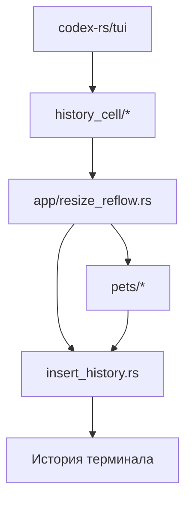

# Архитектура форка Codex

## Быстрая карта

```text
codex-rs/tui
  |
  +-- history_cell/         transcript-ячейки с исходными путями
  |      |
  |      +-- HistoryCellDisplayItem::LocalImage(path)
  |
  +-- app/resize_reflow.rs  подготовка вставки в историю
  |      |
  |      +-- HistoryInsertItem::Image
  |
  +-- pets/                 подготовка Kitty / KittyLocalFile / Sixel
  |      |
  |      +-- cache/tui-history-images
  |
  +-- insert_history.rs     запись в историю терминала
```

## Mermaid-схема



## Что важно понять за минуту

- Этот каталог хранит внутреннюю документацию форка, а не официальную
  пользовательскую документацию upstream Codex.
- Архитектурные записи должны ссылаться на реальные пути, symbols, тесты и
  рабочие планы.
- Для фич с потоками данных нужны ASCII и Mermaid схемы, чтобы документ был
  полезен и в терминале, и в Markdown preview.
- Планы работ живут отдельно в `docs/plans/`, follow-ups - в
  `docs/follow-ups/`.

## Где детали

| Тема | Документ |
| --- | --- |
| Локальные превью изображений в истории TUI | [feature:tui-history-image-previews] |
| План развития изображений ассистента/инструментов в истории TUI | [plan:PLAN-TUI-ASSISTANT-IMAGES-001] |
| Отложенные работы по истории изображений | [follow-ups:image-history] |

[feature:tui-history-image-previews]: features/tui-history-image-previews.md
[follow-ups:image-history]: ../follow-ups/README.md
[plan:PLAN-TUI-ASSISTANT-IMAGES-001]: ../plans/archive/2026/PLAN-TUI-ASSISTANT-IMAGES-001/plan.md
