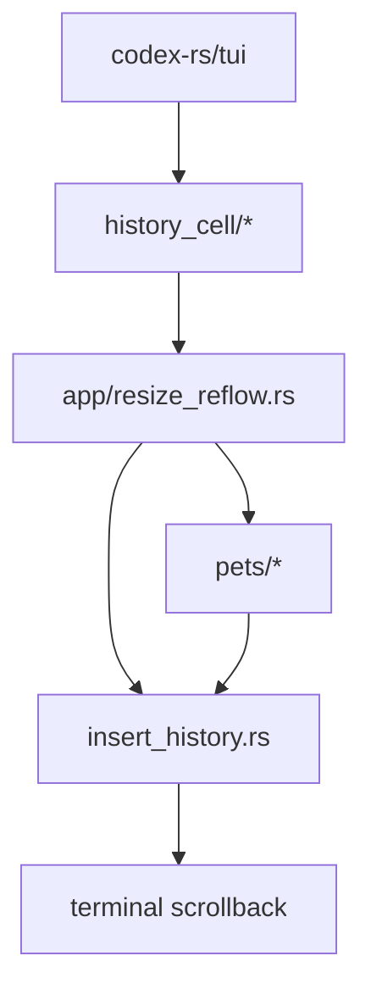

# Архитектура форка Codex

## Быстрая карта

```text
codex-rs/tui
  |
  +-- history_cell/         source-backed transcript cells
  |      |
  |      +-- HistoryCellDisplayItem::LocalImage(path)
  |
  +-- app/resize_reflow.rs  history insertion preparation
  |      |
  |      +-- HistoryInsertItem::Image
  |
  +-- pets/                 Kitty / KittyLocalFile / Sixel preparation
  |      |
  |      +-- cache/tui-history-images
  |
  +-- insert_history.rs     terminal scrollback writer
```

## Mermaid-схема



## Что важно понять за минуту

- Этот каталог хранит внутреннюю документацию форка, а не официальную
  пользовательскую документацию upstream Codex.
- Архитектурные записи должны ссылаться на реальные пути, symbols, тесты и
  рабочие планы.
- Для фич с потоками данных нужны ASCII и Mermaid схемы, чтобы документ был
  полезен и в терминале, и в Markdown preview.
- Планы работ живут отдельно в `docs/plans/`, follow-ups - в
  `docs/follow-ups/`.

## Где детали

| Тема | Документ |
| --- | --- |
| TUI local image previews in history | [feature:tui-history-image-previews] |
| План развития assistant/tool image previews | [plan:PLAN-TUI-ASSISTANT-IMAGES-001] |
| Отложенные работы по image history | [follow-ups:image-history] |

[feature:tui-history-image-previews]: features/tui-history-image-previews.md
[follow-ups:image-history]: ../follow-ups/README.md
[plan:PLAN-TUI-ASSISTANT-IMAGES-001]: ../plans/PLAN-TUI-ASSISTANT-IMAGES-001/plan.md
