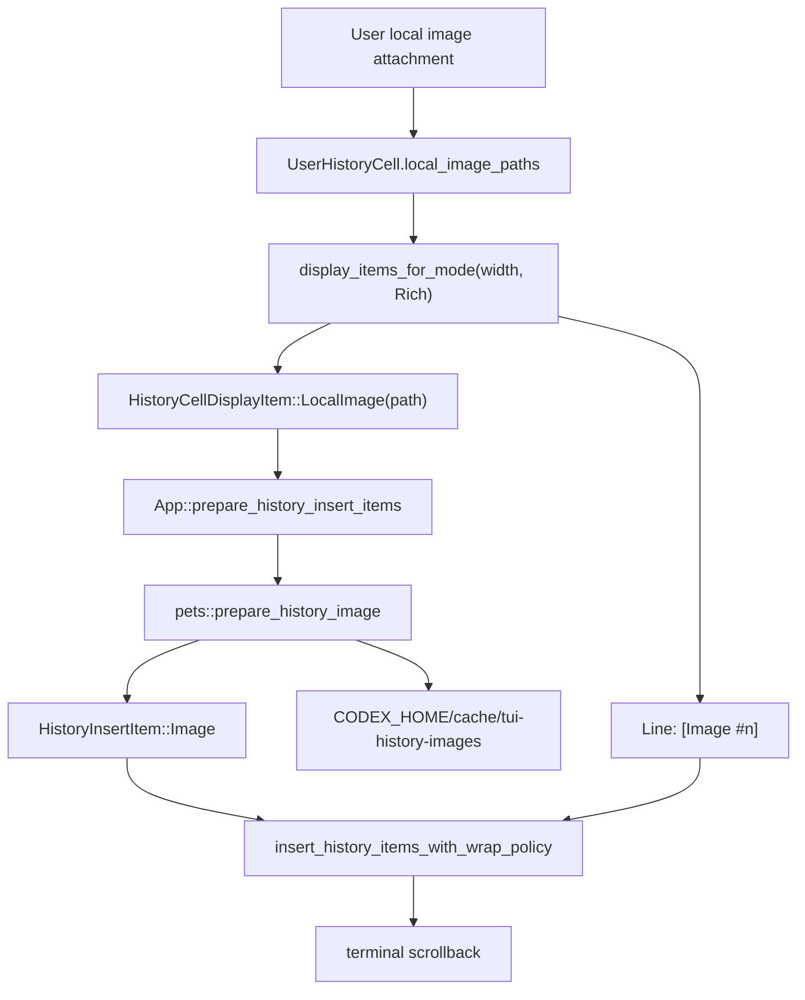

# Feature: TUI history local image previews

## Status

implemented

## Summary

| Field | Value |
| --- | --- |
| Purpose | User local image attachments render in TUI history as terminal image previews with `[Image #n]` text fallback. |
| Current state | Implemented for user attachments and normal history insertion. |
| Done / Implemented | `LocalImage` display item, image preparation through `/pets`, terminal scrollback insertion, PNG normalization for Kitty, targeted tests. |
| Open / Deferred | Assistant/tool source path, bitmap re-emission during resize/reflow/replay, and managed resume-stable image ownership. |
| Next | Continue [plan:PLAN-TUI-ASSISTANT-IMAGES-001], especially [stage:PLAN-TUI-ASSISTANT-IMAGES-001:002]. |

## Detail Map

| Detail | Where |
| --- | --- |
| Current shape | [details:current-shape] |
| Code map | [details:code-map] |
| Flow | [details:flow] |
| Contracts | [details:contracts] |
| Invariants | [details:invariants] |
| Runtime notes | [details:runtime-notes] |
| Verification | [details:verification] |
| Links | [details:links] |

## Purpose

Показывать локальные изображения из пользовательских attachments в TUI history
как terminal image previews, сохраняя текстовый fallback `[Image #n]` для raw
mode, copy, unsupported terminals, resize/reflow и replay paths.

Фича относится к локальной Hermione-ветке Codex и не является официальной
пользовательской документацией upstream.

## Current Shape

Локальный путь изображения остается source-backed частью `UserHistoryCell`.
В rich history insertion cell отдает обычные текстовые строки и дополнительный
маркер `HistoryCellDisplayItem::LocalImage(path)`. App layer превращает marker
в `HistoryInsertItem::Image`, используя тот же terminal-image protocol stack,
что и `/pets`.

Для Kitty и KittyLocalFile изображения сначала нормализуются в PNG-preview в
`CODEX_HOME/cache/tui-history-images`, потому что Kitty payload объявляется как
`f=100`. Для Sixel создается sixel cache asset. Если terminal image protocol
недоступен или подготовка asset падает, история остается читаемой через
текстовый fallback.

## Code Map

- `codex-rs/tui/src/history_cell/mod.rs`
  - `HistoryCellDisplayItem::LocalImage`: marker для terminal-backed bitmap
    preview вне ratatui `Line`.
  - `HistoryCell::display_items_for_mode`: rich mode может вернуть строки и
    image markers.
- `codex-rs/tui/src/history_cell/messages.rs`
  - `UserHistoryCell.local_image_paths`: source локальных attachment paths и
    fallback labels `[Image #n]`.
- `codex-rs/tui/src/app/resize_reflow.rs`
  - `App::prepare_history_insert_items`: превращает `LocalImage` marker в
    `HistoryInsertItem::Image` best-effort.
- `codex-rs/tui/src/pets/mod.rs`
  - `prepare_history_image`: готовит Kitty, KittyLocalFile или Sixel payload и
    размер preview.
- `codex-rs/tui/src/pets/image_protocol.rs`
  - `png_frame`, `sixel_frame`: создают cache assets для terminal protocols.
- `codex-rs/tui/src/insert_history.rs`
  - `HistoryInsertItem::Image`: резервирует строки scrollback и пишет image
    payload напрямую в terminal writer.
- `codex-rs/tui/src/tui.rs`
  - `insert_history_items_with_wrap_policy`: TUI boundary для вставки mixed
    line/image history items.

## Flow

```text
User local image attachment
  |
  v
UserHistoryCell.local_image_paths
  |
  v
Rich mode display_items_for_mode(width)
  |
  +-- Line("[Image #n]") fallback
  |
  +-- HistoryCellDisplayItem::LocalImage(path)
          |
          v
     App::prepare_history_insert_items
          |
          v
     pets::prepare_history_image
          |
          +-- Kitty / KittyLocalFile: PNG preview cache
          +-- Sixel: sixel preview cache
          |
          v
     HistoryInsertItem::Image
          |
          v
     insert_history_items_with_wrap_policy
          |
          v
     terminal scrollback
```



## Contracts

- `HistoryCell::display_items_for_mode(width, HistoryRenderMode::Rich)` может
  вернуть `HistoryCellDisplayItem::LocalImage(path)` только рядом с текстовым
  fallback line.
- `HistoryRenderMode::Raw` остается line-only. Raw/copy-friendly история не
  содержит terminal image payload.
- `App::prepare_history_insert_items` является best-effort boundary: при
  unsupported terminal или ошибке asset preparation marker пропускается, а
  fallback line остается в истории.
- `pets::prepare_history_image` возвращает `TerminalHistoryImage` с координатой
  `x = 2`, размером в строках/колонках и payload типа `Text` или `Bytes`.
- `insert_history_items_with_wrap_policy` резервирует rows для
  `HistoryInsertItem::Image` так же, как считает wrapped rows для text lines.

## Invariants

- Не встраивать raw terminal escape payload в ratatui `Line`.
- Не читать локальные пути из произвольного Markdown/plain text как trusted
  image source.
- Всегда сохранять `[Image #n]` fallback рядом с bitmap preview.
- Для Kitty и KittyLocalFile history previews сначала делать PNG-preview cache,
  потому что payload отправляется как PNG (`f=100`).
- `tmux` и `zellij` остаются fallback-only через текущий
  `detect_pet_image_support` policy.

## Runtime Notes

- Поддерживаемые protocol paths: Kitty inline data, Kitty local file graphics и
  Sixel.
- Cache root: `CODEX_HOME/cache/tui-history-images`.
- Target preview height: `HISTORY_IMAGE_TARGET_ROWS = 12`; width ограничивается
  текущей terminal width через `max_columns = width - 4`.
- Normal history insertion может вставить bitmap preview. Resize reflow,
  initial replay и overlay-deferred paths сейчас остаются line-oriented и
  сохраняют только fallback labels.
- Source image ownership остается у исходного attachment path; cache содержит
  derived preview assets, а не managed копию оригинала.

## Verification

- Cell marker emission:
  `cargo test -p codex-tui user_history_cell_emits_local_image_items_for_terminal_history`

  Proves: `UserHistoryCell` в rich mode отдает `LocalImage` marker и fallback
  label.

- Terminal image row handling:
  `cargo test -p codex-tui history_image_restores_cursor_and_reserves_rows`

  Proves: `insert_history` резервирует rows и восстанавливает cursor при image
  payload.

- Kitty PNG normalization:
  `cargo test -p codex-tui history_image_prepare_kitty_payload_converts_jpeg_to_png`

  Proves: Kitty history preview получает PNG payload даже из JPEG source.

- Width clamp:
  `cargo test -p codex-tui history_image_size_clamps_wide_images_to_available_columns`

  Proves: preview не выходит за доступную ширину history.

- Full TUI crate:
  `cargo test -p codex-tui`

  Proves: regression coverage для TUI paths, если нужен полный локальный
  прогон.

## Links

- Plan: [plan:PLAN-TUI-ASSISTANT-IMAGES-001]
- Stage 002: [stage:PLAN-TUI-ASSISTANT-IMAGES-001:002]
- Resize/reflow follow-up: [follow-up:FU-2026-001]
- Assistant/tool source follow-up: [follow-up:FU-2026-002]
- Follow-ups: [follow-ups:image-history]
- Implementation commits: `96feb7e0d Add terminal image previews to TUI history`,
  `483c08245 Normalize history images for Kitty previews`

[details:code-map]: #code-map
[details:contracts]: #contracts
[details:current-shape]: #current-shape
[details:flow]: #flow
[details:invariants]: #invariants
[details:links]: #links
[details:runtime-notes]: #runtime-notes
[details:verification]: #verification
[follow-up:FU-2026-001]: ../../follow-ups/FU-2026-001-tui-history-image-reflow-reemit.md
[follow-up:FU-2026-002]: ../../follow-ups/FU-2026-002-tui-assistant-tool-image-source.md
[follow-ups:image-history]: ../../follow-ups/README.md
[plan:PLAN-TUI-ASSISTANT-IMAGES-001]: ../../plans/PLAN-TUI-ASSISTANT-IMAGES-001/plan.md
[stage:PLAN-TUI-ASSISTANT-IMAGES-001:002]: ../../plans/PLAN-TUI-ASSISTANT-IMAGES-001/stages/002-local-image-history-cell.md
