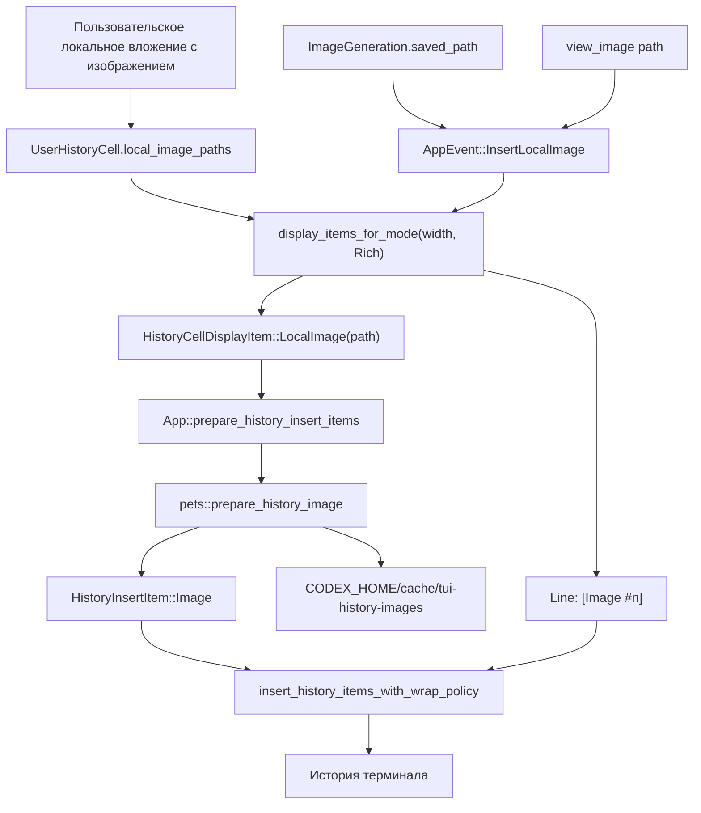

# Фича: локальные превью изображений в истории TUI

## Статус

`implemented`

## Кратко

| Поле | Значение |
| --- | --- |
| Назначение | Локальные пользовательские, ассистентские и tool-generated изображения рендерятся в истории TUI как терминальные превью с текстовым fallback. |
| Текущее состояние | Реализовано для пользовательских вложений, обычной вставки в историю, controlled `InsertLocalImage` path, `view_image`, `ImageGeneration.saved_path` и item-level replay/reflow. |
| Готово / реализовано | Элемент отображения `LocalImage`, `LocalImageHistoryCell`, `AppEvent::InsertLocalImage`, validation, `view_image`, `ImageGeneration.saved_path`, replay/reflow, подготовка через `/pets`, PNG-нормализация и Unicode placeholders для Kitty, точечные тесты. |
| Открыто / отложено | Managed ownership оригинальных изображений после resume не реализован; если source path недоступен, остается fallback. При экстремально узком окне preview может не поместиться. Настраиваемые per-image preview sizes вынесены в [follow-up:FU-2026-006]. |
| Следующий шаг | По запросу: вернуться к [follow-up:FU-2026-006] для `small` / `normal` / `large` preview sizes и config rows. |

## Карта деталей

| Деталь | Где |
| --- | --- |
| Текущее устройство | [details:current-shape] |
| Карта кода | [details:code-map] |
| Поток | [details:flow] |
| Контракты | [details:contracts] |
| Инварианты | [details:invariants] |
| Runtime-заметки | [details:runtime-notes] |
| Проверки | [details:verification] |
| Связи | [details:links] |

## Назначение

Показывать локальные изображения из пользовательских вложений,
ассистентских/tool-generated sources и replay/reflow paths в истории TUI как
терминальные превью, сохраняя текстовый fallback `[Image #n]` / `[Image]` для
`Raw` mode, копирования, неподдерживаемых терминалов и ошибок подготовки asset.

Фича относится к локальной Hermione-ветке Codex и не является официальной
пользовательской документацией upstream.

## Текущее устройство

Локальный путь изображения остается частью `UserHistoryCell` для
пользовательских вложений или приходит через controlled app event для
ассистентских/tool-generated изображений. В `Rich` mode ячейка для вставки в
историю отдаёт обычные текстовые строки и дополнительный маркер
`HistoryCellDisplayItem::LocalImage(path)`. Слой `App` превращает этот маркер в
`HistoryInsertItem::Image`, используя тот же стек подготовки terminal-image, что
и `/pets`, но с другим способом привязки к истории для Kitty.

Для Kitty и KittyLocalFile изображения сначала нормализуются в PNG-preview в
`CODEX_HOME/cache/tui-history-images`, потому что Kitty payload объявляется как
`f=100`. Затем Codex передает image data и создает virtual placement `U=1`, а в
scrollback печатает Unicode placeholder-ячейки `U+10EEEE` с явными
row/column-diacritics как обычный текст. Так preview движется вместе с историей
при новом выводе, resize и scrollback.
Для Sixel создается sixel cache asset. Если протокол terminal image недоступен
или подготовка asset падает, история остается читаемой через текстовый fallback.

Resize reflow, initial replay, thread-switch tail replay и overlay-deferred
history paths сохраняют `HistoryCellDisplayItem::LocalImage` до границы
`prepare_history_insert_items`, поэтому повторная запись scrollback может снова
подготовить terminal image payload, если source path еще доступен.

## Карта кода

- [`codex-rs/tui/src/history_cell/mod.rs`][code:history-cell]
  - `HistoryCellDisplayItem::LocalImage`: маркер для bitmap-preview,
    поддержанного terminal protocol, вне ratatui `Line`.
  - `HistoryCell::display_items_for_mode`: `Rich` mode может вернуть строки и
    маркеры изображений.
- [`codex-rs/tui/src/history_cell/messages.rs`][code:history-cell-messages]
  - `UserHistoryCell.local_image_paths`: источник локальных путей вложений и
    fallback-меток `[Image #n]`.
- [`codex-rs/tui/src/history_cell/local_image.rs`][code:local-image-cell]
  - `LocalImageHistoryCell`: controlled cell для ассистента/инструментов с fallback
    `[Image]` / `[Image: <caption>]` и marker `LocalImage(path)` в `Rich`.
- [`codex-rs/tui/src/app_event.rs`][code:app-event]
  - `AppEvent::InsertLocalImage { path, caption }`: trusted app-layer event для
    локальных preview с исходным файлом.
- [`codex-rs/tui/src/app/event_dispatch.rs`][code:event-dispatch]
  - validation для `InsertLocalImage`: `regular file` и decode через `image`
    crate перед созданием bitmap marker.
- [`codex-rs/tui/src/chatwidget/tool_lifecycle.rs`][code:tool-lifecycle]
  - `ChatWidget::on_view_image_tool_call`: первый production caller, который
    отправляет `AppEvent::InsertLocalImage` вместо legacy text-only cell.
  - `ChatWidget::on_image_generation_end`: отправляет `ImageGeneration.saved_path`
    через `AppEvent::InsertLocalImage`; если path отсутствует, сохраняет
    text-only history cell.
- [`codex-rs/tui/src/app/resize_reflow.rs`][code:resize-reflow]
  - `App::prepare_history_insert_items`: в best-effort-режиме превращает
    маркер `LocalImage` в `HistoryInsertItem::Image`.
  - Resize reflow и initial/thread-switch replay работают на уровне
    `HistoryCellDisplayItem`, а не только `Line`, чтобы не терять bitmap marker
    до финальной подготовки terminal image.
- [`codex-rs/tui/src/pets/mod.rs`][code:pets-mod]
  - `prepare_history_image`: готовит payload для Kitty, KittyLocalFile или
    Sixel и размер preview.
- [`codex-rs/tui/src/pets/image_protocol.rs`][code:image-protocol]
  - `png_frame`, `sixel_frame`: создают cache assets для terminal protocols.
  - `kitty_transmit_png_with_virtual_placement`,
    `kitty_transmit_png_file_with_virtual_placement`: передают PNG и создают
    Kitty virtual placement для Unicode placeholders.
- [`codex-rs/tui/src/insert_history.rs`][code:insert-history]
  - `HistoryInsertItem::Image`: резервирует строки scrollback и пишет image
    payload напрямую в terminal writer.
  - `KittyUnicodePlaceholder`: печатает placeholder-grid как текстовые ячейки
    scrollback вместо floating screen placement.
- [`codex-rs/tui/src/kitty_placeholder.rs`][code:kitty-placeholder]
  - Пишет `U+10EEEE` cells с явными row/column-diacritics для Kitty virtual
    placement.
- [`codex-rs/tui/src/tui.rs`][code:tui]
  - `insert_history_items_with_wrap_policy`: граница TUI для вставки смешанных
    line/image элементов истории.

## Поток

```text
Пользовательское локальное вложение / controlled local image source
  |
  +-- UserHistoryCell.local_image_paths
  |
  +-- AppEvent::InsertLocalImage
  |
  v
Rich mode display_items_for_mode(width)
  |
  +-- Line("[Image #n]" / "[Image: caption]") fallback
  |
  +-- HistoryCellDisplayItem::LocalImage(path)
          |
          v
     App::prepare_history_insert_items
          |
          v
     pets::prepare_history_image
          |
          +-- Kitty / KittyLocalFile: PNG preview cache
          +-- Sixel: sixel preview cache
          |
          v
     HistoryInsertItem::Image
          |
          v
     insert_history_items_with_wrap_policy
          |
          v
     история терминала
```



## Контракты

- `HistoryCell::display_items_for_mode(width, HistoryRenderMode::Rich)` может
  вернуть `HistoryCellDisplayItem::LocalImage(path)` только рядом с текстовой
  строкой fallback.
- `AppEvent::InsertLocalImage { path, caption }` является controlled boundary
  для ассистентских/инструментальных local images: path должен быть regular
  file и успешно декодироваться через `image` crate до создания marker.
- `ThreadItem::ImageView` / `view_image` является первым production source для
  `InsertLocalImage`; caption строится из `display_path_for(path, cwd)`.
- `ImageGeneration.saved_path` является controlled source для
  `InsertLocalImage`: core сохраняет artifact под
  `CODEX_HOME/generated_images/<session>/<call>.png`; caption строится из
  непустого `revised_prompt`, иначе из `call_id`.
- Если `ImageGeneration.saved_path` отсутствует, TUI оставляет text-only
  `Generated Image` history cell без bitmap marker.
- `HistoryRenderMode::Raw` остается line-only. История для Raw/copy не
  содержит terminal image payload.
- `App::prepare_history_insert_items` является best-effort boundary: при
  неподдерживаемом терминале или ошибке подготовки asset маркер пропускается, а
  строка fallback остается в истории.
- Resize/reflow/replay paths должны сохранять `HistoryCellDisplayItem::LocalImage`
  до `prepare_history_insert_items`; преждевременная конвертация в `Line`
  запрещена для `Rich` history.
- `pets::prepare_history_image` возвращает `TerminalHistoryImage` с координатой
  `x = 2`, размером в строках/колонках и payload типа
  `KittyUnicodePlaceholder` или `Bytes`.
- `insert_history_items_with_wrap_policy` резервирует rows для
  `HistoryInsertItem::Image` так же, как считает wrapped rows для текстовых
  строк.
- Managed ownership оригинального файла не является контрактом этой фичи:
  cache хранит derived preview assets, а source path должен оставаться
  доступным для повторной подготовки bitmap payload.

## Инварианты

- Не встраивать raw terminal escape payload в ratatui `Line`.
- Для Kitty history не использовать floating screen placement как финальное
  отображение: image должен быть привязан к scrollback через Unicode placeholders.
- Не читать локальные пути из произвольного Markdown/plain text как trusted
  image source.
- Всегда сохранять fallback `[Image #n]` рядом с bitmap preview.
- Для Kitty и KittyLocalFile history previews сначала делать PNG-preview cache,
  потому что payload отправляется как PNG (`f=100`).
- Kitty history preview должен передавать PNG как virtual placement `U=1` и
  печатать `U+10EEEE` placeholder cells с row/column-diacritics; иначе bitmap
  остается привязанным к экранному слою, либо Kitty показывает только часть
  grid.
- `tmux` и `zellij` работают только с fallback через текущий
  `detect_pet_image_support` policy.

## Runtime-заметки

- Поддерживаемые пути протоколов: Kitty inline data, Kitty local file graphics и
  Sixel.
- Корень cache: `CODEX_HOME/cache/tui-history-images`.
- Generated image artifacts, которые могут стать source для TUI preview, лежат
  под `CODEX_HOME/generated_images/<session>/<call>.png`.
- Целевая высота preview: `HISTORY_IMAGE_TARGET_ROWS = 12`; ширина
  ограничивается текущей шириной терминала через `max_columns = width - 4`.
- Настраиваемые per-image размеры preview (`small` / `normal` / `large`) и
  config rows отложены в [follow-up:FU-2026-006]. Дефолт должен сохранить
  текущее поведение: `normal = 12 rows`.
- Обычная вставка в историю, resize reflow, initial replay, thread-switch tail
  replay и overlay-deferred paths могут вставить bitmap preview.
- В Kitty обычный `a=T` screen placement подходит для ambient `/pets`, но не для
  history: он может оставаться привязанным к нижней части screen while text
  output scrolls. History path использует Unicode placeholders, чтобы terminal
  двигал bitmap вместе с текстовыми ячейками.
- Строки Kitty placeholder-grid должны вставляться как реальные `\r\n` строки
  scrollback. Cursor movement внутри нижней строки scroll region не создает
  новые текстовые строки, и Kitty показывает только одну полоску изображения.
- Codex отслеживает Kitty placeholder image id до момента, когда весь grid ушел
  выше видимой history-области, и удаляет image id. Это безопасная деградация:
  при ручном scrollback назад остается текстовый fallback, зато bitmap не
  залипает у верхней границы viewport и не накладывается на новый текст.
- Пользовательский smoke в Kitty подтвердил, что прямой Kitty graphics command
  показывает PNG, TUI показывает картинку через `view_image`, а preview
  переживает resize. При очень жестком shrink, когда окно меньше картинки,
  preview может не поместиться.
- Владение исходным изображением остается у исходного пути вложения; cache
  содержит derived preview assets, а не managed копию оригинала.

## Проверки

- Эмиссия маркера cell:
  `cargo test -p codex-tui user_history_cell_emits_local_image_items_for_terminal_history`

  Проверяет: `UserHistoryCell` в `Rich` mode отдает маркер `LocalImage` и
  fallback-метку.

- Обработка строк terminal image:
  `cargo test -p codex-tui history_image_restores_cursor_and_reserves_rows`

  Проверяет: `insert_history` резервирует rows и восстанавливает cursor при image
  payload.

- PNG-нормализация Kitty:
  `cargo test -p codex-tui history_image_prepare_kitty_payload_converts_jpeg_to_png`

  Проверяет: Kitty history preview получает PNG payload даже из JPEG source.

- Kitty virtual placement:
  `cargo test -p codex-tui kitty_png_virtual_placement_transmits_without_screen_placement`

  Проверяет: Kitty history payload передает image data и создает virtual
  placement `U=1`, а не screen placement.

- Kitty placeholder cells:
  `cargo test -p codex-tui kitty_placeholder_image_writes_text_anchored_cells`

  Проверяет: history insertion печатает `U+10EEEE` placeholder-grid с явными
  row/column-diacritics, который должен двигаться вместе с текстовым scrollback.

- Kitty placeholder lifecycle:
  `cargo test -p codex-tui kitty_placeholder_image_is_deleted_after_scrolling_off_visible_history`

  Проверяет: после ухода Kitty placeholder image выше видимой history-области
  Codex отправляет delete для image id, чтобы избежать overlay/stale bitmap.

- Ограничение ширины:
  `cargo test -p codex-tui history_image_size_clamps_wide_images_to_available_columns`

  Проверяет: preview не выходит за доступную ширину history.

- Controlled cell для ассистента/инструментов:
  `cargo test -p codex-tui local_image`

  Проверяет: `LocalImageHistoryCell` отдает marker только в `Rich`, validation
  принимает декодируемый regular file, invalid image event не создает bitmap
  marker, Markdown image syntax не создает `LocalImage`.

- Production caller `view_image`:
  `cargo test -p codex-tui view_image_tool_call_emits_local_image_event`

  Проверяет: `ThreadItem::ImageView` отправляет `InsertLocalImage` и не создает
  legacy text-only history cell.

- Production caller `ImageGeneration.saved_path`:
  `env RUST_MIN_STACK=8388608 cargo test -p codex-tui image_generation_call`

  Проверяет: `ImageGeneration.saved_path` отправляет `InsertLocalImage` без
  duplicate legacy text-only cell, а no-path fallback сохраняет text-only
  history cell.

- Replay/reflow для local images:
  `env RUST_MIN_STACK=8388608 cargo test -p codex-tui resize_reflow`

  Проверяет: resize reflow сохраняет `LocalImage` display item, а capped/uncapped
  reflow продолжает отдавать ожидаемый tail.

- Подсчет строк mixed history items:
  `env RUST_MIN_STACK=8388608 cargo test -p codex-tui insert_history_items_with_wrap_policy_counts_image_rows`

  Проверяет: `insert_history_items_with_wrap_policy` учитывает image rows вместе
  с текстовыми строками.

- Manual Kitty visual smoke:
  direct Kitty graphics command + TUI `view_image` path.

  Проверяет: Kitty protocol показывает PNG, TUI показывает картинку в истории,
  preview переживает resize кроме экстремально узкого окна меньше preview.

- Полный TUI crate:
  `cargo test -p codex-tui`

  Проверяет: regression coverage для TUI paths, если нужен полный локальный
  прогон.

## Связи

- План: [plan:PLAN-TUI-ASSISTANT-IMAGES-001]
- Этап 002: [stage:PLAN-TUI-ASSISTANT-IMAGES-001:002]
- Этап 003: [stage:PLAN-TUI-ASSISTANT-IMAGES-001:003]
- Этап 004: [stage:PLAN-TUI-ASSISTANT-IMAGES-001:004]
- Этап 005: [stage:PLAN-TUI-ASSISTANT-IMAGES-001:005]
- Закрытая работа по resize/reflow: [follow-up:FU-2026-001]
- Закрытая работа по контролируемому пути источника: [follow-up:FU-2026-002]
- Настраиваемые размеры preview: [follow-up:FU-2026-006]
- Отложенные работы: [follow-ups:image-history]
- Коммиты реализации: `96feb7e0d Add terminal image previews to TUI history`,
  `483c08245 Normalize history images for Kitty previews`

[code:app-event]: ../../../codex-rs/tui/src/app_event.rs
[code:event-dispatch]: ../../../codex-rs/tui/src/app/event_dispatch.rs
[code:history-cell]: ../../../codex-rs/tui/src/history_cell/mod.rs
[code:history-cell-messages]: ../../../codex-rs/tui/src/history_cell/messages.rs
[code:image-protocol]: ../../../codex-rs/tui/src/pets/image_protocol.rs
[code:insert-history]: ../../../codex-rs/tui/src/insert_history.rs
[code:kitty-placeholder]: ../../../codex-rs/tui/src/kitty_placeholder.rs
[code:local-image-cell]: ../../../codex-rs/tui/src/history_cell/local_image.rs
[code:pets-mod]: ../../../codex-rs/tui/src/pets/mod.rs
[code:resize-reflow]: ../../../codex-rs/tui/src/app/resize_reflow.rs
[code:tool-lifecycle]: ../../../codex-rs/tui/src/chatwidget/tool_lifecycle.rs
[code:tui]: ../../../codex-rs/tui/src/tui.rs
[details:code-map]: #карта-кода
[details:contracts]: #контракты
[details:current-shape]: #текущее-устройство
[details:flow]: #поток
[details:invariants]: #инварианты
[details:links]: #связи
[details:runtime-notes]: #runtime-заметки
[details:verification]: #проверки
[follow-up:FU-2026-001]: ../../follow-ups/archive/2026/FU-2026-001-tui-history-image-reflow-reemit.md
[follow-up:FU-2026-002]: ../../follow-ups/archive/2026/FU-2026-002-tui-assistant-tool-image-source.md
[follow-up:FU-2026-006]: ../../follow-ups/FU-2026-006-tui-history-image-preview-size.md
[follow-ups:image-history]: ../../follow-ups/README.md
[plan:PLAN-TUI-ASSISTANT-IMAGES-001]: ../../plans/archive/2026/PLAN-TUI-ASSISTANT-IMAGES-001/plan.md
[stage:PLAN-TUI-ASSISTANT-IMAGES-001:002]: ../../plans/archive/2026/PLAN-TUI-ASSISTANT-IMAGES-001/stages/002-local-image-history-cell.md
[stage:PLAN-TUI-ASSISTANT-IMAGES-001:003]: ../../plans/archive/2026/PLAN-TUI-ASSISTANT-IMAGES-001/stages/003-wire-assistant-image-source.md
[stage:PLAN-TUI-ASSISTANT-IMAGES-001:004]: ../../plans/archive/2026/PLAN-TUI-ASSISTANT-IMAGES-001/stages/004-wire-image-generation-saved-path.md
[stage:PLAN-TUI-ASSISTANT-IMAGES-001:005]: ../../plans/archive/2026/PLAN-TUI-ASSISTANT-IMAGES-001/stages/005-replay-resize-and-terminal-verification.md
