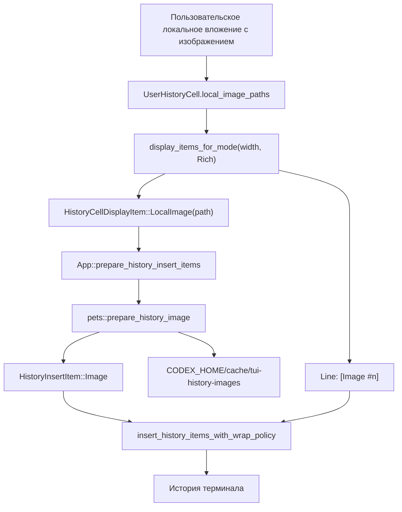

# Фича: локальные превью изображений в истории TUI

## Статус

`implemented`

## Кратко

| Поле | Значение |
| --- | --- |
| Назначение | Локальные пользовательские вложения рендерятся в истории TUI как терминальные превью изображений с текстовым fallback `[Image #n]`. |
| Текущее состояние | Реализовано для пользовательских вложений и обычной вставки в историю. |
| Готово / реализовано | Элемент отображения `LocalImage`, подготовка изображений через `/pets`, вставка в историю терминала, PNG-нормализация для Kitty, точечные тесты. |
| Открыто / отложено | Источник изображений от ассистента/инструментов, повторная эмиссия bitmap-превью при resize/reflow/replay и управляемое владение артефактами изображений, стабильное после resume. |
| Следующий шаг | Продолжить [plan:PLAN-TUI-ASSISTANT-IMAGES-001], особенно [stage:PLAN-TUI-ASSISTANT-IMAGES-001:002]. |

## Карта деталей

| Деталь | Где |
| --- | --- |
| Текущее устройство | [details:current-shape] |
| Карта кода | [details:code-map] |
| Поток | [details:flow] |
| Контракты | [details:contracts] |
| Инварианты | [details:invariants] |
| Runtime-заметки | [details:runtime-notes] |
| Проверки | [details:verification] |
| Связи | [details:links] |

## Назначение

Показывать локальные изображения из пользовательских вложений в истории TUI как
терминальные превью, сохраняя текстовый fallback `[Image #n]` для `Raw` mode,
копирования, неподдерживаемых терминалов, resize/reflow и replay-сценариев.

Фича относится к локальной Hermione-ветке Codex и не является официальной
пользовательской документацией upstream.

## Текущее устройство

Локальный путь изображения остается частью `UserHistoryCell`, привязанной к
source path.
В `Rich` mode history insertion cell отдаёт обычные текстовые строки и
дополнительный маркер `HistoryCellDisplayItem::LocalImage(path)`. Слой `App`
превращает этот маркер в `HistoryInsertItem::Image`, используя тот же стек
протокола terminal-image, что и `/pets`.

Для Kitty и KittyLocalFile изображения сначала нормализуются в PNG-preview в
`CODEX_HOME/cache/tui-history-images`, потому что Kitty payload объявляется как
`f=100`. Для Sixel создается sixel cache asset. Если протокол terminal image
недоступен или подготовка asset падает, история остается читаемой через
текстовый fallback.

## Карта кода

- [`codex-rs/tui/src/history_cell/mod.rs`][code:history-cell]
  - `HistoryCellDisplayItem::LocalImage`: маркер для bitmap-preview,
    поддержанного terminal protocol, вне ratatui `Line`.
  - `HistoryCell::display_items_for_mode`: `Rich` mode может вернуть строки и
    маркеры изображений.
- [`codex-rs/tui/src/history_cell/messages.rs`][code:history-cell-messages]
  - `UserHistoryCell.local_image_paths`: источник локальных путей вложений и
    fallback-меток `[Image #n]`.
- [`codex-rs/tui/src/app/resize_reflow.rs`][code:resize-reflow]
  - `App::prepare_history_insert_items`: в best-effort-режиме превращает
    маркер `LocalImage` в `HistoryInsertItem::Image`.
- [`codex-rs/tui/src/pets/mod.rs`][code:pets-mod]
  - `prepare_history_image`: готовит payload для Kitty, KittyLocalFile или
    Sixel и размер preview.
- [`codex-rs/tui/src/pets/image_protocol.rs`][code:image-protocol]
  - `png_frame`, `sixel_frame`: создают cache assets для terminal protocols.
- [`codex-rs/tui/src/insert_history.rs`][code:insert-history]
  - `HistoryInsertItem::Image`: резервирует строки scrollback и пишет image
    payload напрямую в terminal writer.
- [`codex-rs/tui/src/tui.rs`][code:tui]
  - `insert_history_items_with_wrap_policy`: граница TUI для вставки смешанных
    line/image элементов истории.

## Поток

```text
Пользовательское локальное вложение с изображением
  |
  v
UserHistoryCell.local_image_paths
  |
  v
Rich mode display_items_for_mode(width)
  |
  +-- Line("[Image #n]") fallback
  |
  +-- HistoryCellDisplayItem::LocalImage(path)
          |
          v
     App::prepare_history_insert_items
          |
          v
     pets::prepare_history_image
          |
          +-- Kitty / KittyLocalFile: PNG preview cache
          +-- Sixel: sixel preview cache
          |
          v
     HistoryInsertItem::Image
          |
          v
     insert_history_items_with_wrap_policy
          |
          v
     история терминала
```



## Контракты

- `HistoryCell::display_items_for_mode(width, HistoryRenderMode::Rich)` может
  вернуть `HistoryCellDisplayItem::LocalImage(path)` только рядом с текстовой
  строкой fallback.
- `HistoryRenderMode::Raw` остается line-only. История для Raw/copy не
  содержит terminal image payload.
- `App::prepare_history_insert_items` является best-effort boundary: при
  неподдерживаемом терминале или ошибке подготовки asset маркер пропускается, а
  строка fallback остается в истории.
- `pets::prepare_history_image` возвращает `TerminalHistoryImage` с координатой
  `x = 2`, размером в строках/колонках и payload типа `Text` или `Bytes`.
- `insert_history_items_with_wrap_policy` резервирует rows для
  `HistoryInsertItem::Image` так же, как считает wrapped rows для текстовых
  строк.

## Инварианты

- Не встраивать raw terminal escape payload в ratatui `Line`.
- Не читать локальные пути из произвольного Markdown/plain text как trusted
  image source.
- Всегда сохранять fallback `[Image #n]` рядом с bitmap preview.
- Для Kitty и KittyLocalFile history previews сначала делать PNG-preview cache,
  потому что payload отправляется как PNG (`f=100`).
- `tmux` и `zellij` работают только с fallback через текущий
  `detect_pet_image_support` policy.

## Runtime-заметки

- Поддерживаемые пути протоколов: Kitty inline data, Kitty local file graphics и
  Sixel.
- Корень cache: `CODEX_HOME/cache/tui-history-images`.
- Целевая высота preview: `HISTORY_IMAGE_TARGET_ROWS = 12`; ширина
  ограничивается текущей шириной терминала через `max_columns = width - 4`.
- Обычная вставка в историю может вставить bitmap preview. Resize reflow,
  initial replay и overlay-deferred paths сейчас остаются line-oriented и
  сохраняют только fallback-метки.
- Владение исходным изображением остается у исходного пути вложения; cache
  содержит derived preview assets, а не managed копию оригинала.

## Проверки

- Эмиссия маркера cell:
  `cargo test -p codex-tui user_history_cell_emits_local_image_items_for_terminal_history`

  Проверяет: `UserHistoryCell` в `Rich` mode отдает маркер `LocalImage` и
  fallback-метку.

- Обработка строк terminal image:
  `cargo test -p codex-tui history_image_restores_cursor_and_reserves_rows`

  Проверяет: `insert_history` резервирует rows и восстанавливает cursor при image
  payload.

- PNG-нормализация Kitty:
  `cargo test -p codex-tui history_image_prepare_kitty_payload_converts_jpeg_to_png`

  Проверяет: Kitty history preview получает PNG payload даже из JPEG source.

- Ограничение ширины:
  `cargo test -p codex-tui history_image_size_clamps_wide_images_to_available_columns`

  Проверяет: preview не выходит за доступную ширину history.

- Полный TUI crate:
  `cargo test -p codex-tui`

  Проверяет: regression coverage для TUI paths, если нужен полный локальный
  прогон.

## Связи

- План: [plan:PLAN-TUI-ASSISTANT-IMAGES-001]
- Этап 002: [stage:PLAN-TUI-ASSISTANT-IMAGES-001:002]
- Отложенная работа по resize/reflow: [follow-up:FU-2026-001]
- Отложенная работа по источнику assistant/tool изображений: [follow-up:FU-2026-002]
- Отложенные работы: [follow-ups:image-history]
- Коммиты реализации: `96feb7e0d Add terminal image previews to TUI history`,
  `483c08245 Normalize history images for Kitty previews`

[code:history-cell]: ../../../codex-rs/tui/src/history_cell/mod.rs
[code:history-cell-messages]: ../../../codex-rs/tui/src/history_cell/messages.rs
[code:image-protocol]: ../../../codex-rs/tui/src/pets/image_protocol.rs
[code:insert-history]: ../../../codex-rs/tui/src/insert_history.rs
[code:pets-mod]: ../../../codex-rs/tui/src/pets/mod.rs
[code:resize-reflow]: ../../../codex-rs/tui/src/app/resize_reflow.rs
[code:tui]: ../../../codex-rs/tui/src/tui.rs
[details:code-map]: #карта-кода
[details:contracts]: #контракты
[details:current-shape]: #текущее-устройство
[details:flow]: #поток
[details:invariants]: #инварианты
[details:links]: #связи
[details:runtime-notes]: #runtime-заметки
[details:verification]: #проверки
[follow-up:FU-2026-001]: ../../follow-ups/FU-2026-001-tui-history-image-reflow-reemit.md
[follow-up:FU-2026-002]: ../../follow-ups/FU-2026-002-tui-assistant-tool-image-source.md
[follow-ups:image-history]: ../../follow-ups/README.md
[plan:PLAN-TUI-ASSISTANT-IMAGES-001]: ../../plans/PLAN-TUI-ASSISTANT-IMAGES-001/plan.md
[stage:PLAN-TUI-ASSISTANT-IMAGES-001:002]: ../../plans/PLAN-TUI-ASSISTANT-IMAGES-001/stages/002-local-image-history-cell.md
